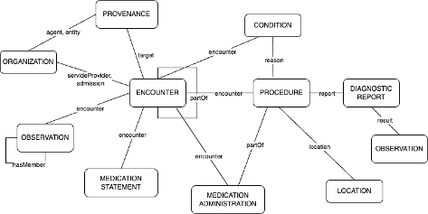

# Profiles - v0.1.0

* [**Table of Contents**](toc.md)
* **Profiles**

## Profiles

The figure below illustrates graphically the main resource types used to structure RES-Q registry data and how they relate to each other. The core resource selected for representing a clinical case is the **Encounter**. While we considered using Composition, we chose a more semantically-driven model over a document-based approach. In the diagram, we omit the Patient resource for readability purposes.

# Extensions

Extensions let you add well-defined data elements beyond the base FHIR resources while preserving compatibility and validation.
 In this guide you’ll find the extensions referenced by the profiles and examples.

* **Purpose & scope:** each extension documents the problem it solves and the data type it introduces.
* **Canonical URL:** ensure the canonical follows your namespace.
* **Context:** the allowed placement (resource/path) is explicitly defined to avoid misuse.
* **Constraints & bindings:** review any required invariants and value set bindings before reuse.
* **Examples:** look for instances showing the extension “in action” in the Examples section or on each extension’s page.
* **Versioning & governance:** check `status` (draft/active) and change notes to assess maturity and impact.

### List of Profiles and Extensions

The links and desriptions for the profiles that have been defined for this implementation guide are listed here:

* [StructureDefinition-age-at-onset-observation-profile-definitions.html](StructureDefinition-age-at-onset-observation-profile-definitions.md)
* [StructureDefinition-age-at-onset-observation-profile-examples.html](StructureDefinition-age-at-onset-observation-profile-examples.md)
* [StructureDefinition-age-at-onset-observation-profile-mappings.html](StructureDefinition-age-at-onset-observation-profile-mappings.md)
* [StructureDefinition-age-at-onset-observation-profile.html](StructureDefinition-age-at-onset-observation-profile.md)
* [StructureDefinition-age-at-onset-observation-profile.profile.history.html](StructureDefinition-age-at-onset-observation-profile.profile.history.md)
* [StructureDefinition-base-stroke-observation-definitions.html](StructureDefinition-base-stroke-observation-definitions.md)
* [StructureDefinition-base-stroke-observation-examples.html](StructureDefinition-base-stroke-observation-examples.md)
* [StructureDefinition-base-stroke-observation-mappings.html](StructureDefinition-base-stroke-observation-mappings.md)
* [StructureDefinition-base-stroke-observation.html](StructureDefinition-base-stroke-observation.md)
* [StructureDefinition-base-stroke-observation.profile.history.html](StructureDefinition-base-stroke-observation.profile.history.md)
* [StructureDefinition-discharge-department-service-ext-definitions.html](StructureDefinition-discharge-department-service-ext-definitions.md)
* [StructureDefinition-discharge-department-service-ext-mappings.html](StructureDefinition-discharge-department-service-ext-mappings.md)
* [StructureDefinition-discharge-department-service-ext.html](StructureDefinition-discharge-department-service-ext.md)
* [StructureDefinition-discharge-department-service-ext.profile.history.html](StructureDefinition-discharge-department-service-ext.profile.history.md)
* [StructureDefinition-discharge-medication-request-profile-definitions.html](StructureDefinition-discharge-medication-request-profile-definitions.md)
* [StructureDefinition-discharge-medication-request-profile-examples.html](StructureDefinition-discharge-medication-request-profile-examples.md)
* [StructureDefinition-discharge-medication-request-profile-mappings.html](StructureDefinition-discharge-medication-request-profile-mappings.md)
* [StructureDefinition-discharge-medication-request-profile.html](StructureDefinition-discharge-medication-request-profile.md)
* [StructureDefinition-discharge-medication-request-profile.profile.history.html](StructureDefinition-discharge-medication-request-profile.profile.history.md)
* [StructureDefinition-first-hospital-ext-definitions.html](StructureDefinition-first-hospital-ext-definitions.md)
* [StructureDefinition-first-hospital-ext-mappings.html](StructureDefinition-first-hospital-ext-mappings.md)
* [StructureDefinition-first-hospital-ext.html](StructureDefinition-first-hospital-ext.md)
* [StructureDefinition-first-hospital-ext.profile.history.html](StructureDefinition-first-hospital-ext.profile.history.md)
* [StructureDefinition-functional-score-observation-profile-definitions.html](StructureDefinition-functional-score-observation-profile-definitions.md)
* [StructureDefinition-functional-score-observation-profile-examples.html](StructureDefinition-functional-score-observation-profile-examples.md)
* [StructureDefinition-functional-score-observation-profile-mappings.html](StructureDefinition-functional-score-observation-profile-mappings.md)
* [StructureDefinition-functional-score-observation-profile.html](StructureDefinition-functional-score-observation-profile.md)
* [StructureDefinition-functional-score-observation-profile.profile.history.html](StructureDefinition-functional-score-observation-profile.profile.history.md)
* [StructureDefinition-gender-snomed-ext-definitions.html](StructureDefinition-gender-snomed-ext-definitions.md)
* [StructureDefinition-gender-snomed-ext-mappings.html](StructureDefinition-gender-snomed-ext-mappings.md)
* [StructureDefinition-gender-snomed-ext.html](StructureDefinition-gender-snomed-ext.md)
* [StructureDefinition-gender-snomed-ext.profile.history.html](StructureDefinition-gender-snomed-ext.profile.history.md)
* [StructureDefinition-hemorrhagic-stroke-bleeding-reason-ext-definitions.html](StructureDefinition-hemorrhagic-stroke-bleeding-reason-ext-definitions.md)
* [StructureDefinition-hemorrhagic-stroke-bleeding-reason-ext-mappings.html](StructureDefinition-hemorrhagic-stroke-bleeding-reason-ext-mappings.md)
* [StructureDefinition-hemorrhagic-stroke-bleeding-reason-ext.html](StructureDefinition-hemorrhagic-stroke-bleeding-reason-ext.md)
* [StructureDefinition-hemorrhagic-stroke-bleeding-reason-ext.profile.history.html](StructureDefinition-hemorrhagic-stroke-bleeding-reason-ext.profile.history.md)
* [StructureDefinition-initial-care-intensity-ext-definitions.html](StructureDefinition-initial-care-intensity-ext-definitions.md)
* [StructureDefinition-initial-care-intensity-ext-mappings.html](StructureDefinition-initial-care-intensity-ext-mappings.md)
* [StructureDefinition-initial-care-intensity-ext.html](StructureDefinition-initial-care-intensity-ext.md)
* [StructureDefinition-initial-care-intensity-ext.profile.history.html](StructureDefinition-initial-care-intensity-ext.profile.history.md)
* [StructureDefinition-ischemic-stroke-etiology-ext-definitions.html](StructureDefinition-ischemic-stroke-etiology-ext-definitions.md)
* [StructureDefinition-ischemic-stroke-etiology-ext-mappings.html](StructureDefinition-ischemic-stroke-etiology-ext-mappings.md)
* [StructureDefinition-ischemic-stroke-etiology-ext.html](StructureDefinition-ischemic-stroke-etiology-ext.md)
* [StructureDefinition-ischemic-stroke-etiology-ext.profile.history.html](StructureDefinition-ischemic-stroke-etiology-ext.profile.history.md)
* [StructureDefinition-observation-timing-context-ext-definitions.html](StructureDefinition-observation-timing-context-ext-definitions.md)
* [StructureDefinition-observation-timing-context-ext-mappings.html](StructureDefinition-observation-timing-context-ext-mappings.md)
* [StructureDefinition-observation-timing-context-ext.html](StructureDefinition-observation-timing-context-ext.md)
* [StructureDefinition-observation-timing-context-ext.profile.history.html](StructureDefinition-observation-timing-context-ext.profile.history.md)
* [StructureDefinition-onset-date-ext-definitions.html](StructureDefinition-onset-date-ext-definitions.md)
* [StructureDefinition-onset-date-ext-mappings.html](StructureDefinition-onset-date-ext-mappings.md)
* [StructureDefinition-onset-date-ext.html](StructureDefinition-onset-date-ext.md)
* [StructureDefinition-onset-date-ext.profile.history.html](StructureDefinition-onset-date-ext.profile.history.md)
* [StructureDefinition-onset-time-ext-definitions.html](StructureDefinition-onset-time-ext-definitions.md)
* [StructureDefinition-onset-time-ext-mappings.html](StructureDefinition-onset-time-ext-mappings.md)
* [StructureDefinition-onset-time-ext.html](StructureDefinition-onset-time-ext.md)
* [StructureDefinition-onset-time-ext.profile.history.html](StructureDefinition-onset-time-ext.profile.history.md)
* [StructureDefinition-patient-age-ext-definitions.html](StructureDefinition-patient-age-ext-definitions.md)
* [StructureDefinition-patient-age-ext-mappings.html](StructureDefinition-patient-age-ext-mappings.md)
* [StructureDefinition-patient-age-ext.html](StructureDefinition-patient-age-ext.md)
* [StructureDefinition-patient-age-ext.profile.history.html](StructureDefinition-patient-age-ext.profile.history.md)
* [StructureDefinition-patient-age-gender-snomed-profile-definitions.html](StructureDefinition-patient-age-gender-snomed-profile-definitions.md)
* [StructureDefinition-patient-age-gender-snomed-profile-examples.html](StructureDefinition-patient-age-gender-snomed-profile-examples.md)
* [StructureDefinition-patient-age-gender-snomed-profile-mappings.html](StructureDefinition-patient-age-gender-snomed-profile-mappings.md)
* [StructureDefinition-patient-age-gender-snomed-profile.html](StructureDefinition-patient-age-gender-snomed-profile.md)
* [StructureDefinition-patient-age-gender-snomed-profile.profile.history.html](StructureDefinition-patient-age-gender-snomed-profile.profile.history.md)
* [StructureDefinition-prior-medication-statement-profile-definitions.html](StructureDefinition-prior-medication-statement-profile-definitions.md)
* [StructureDefinition-prior-medication-statement-profile-examples.html](StructureDefinition-prior-medication-statement-profile-examples.md)
* [StructureDefinition-prior-medication-statement-profile-mappings.html](StructureDefinition-prior-medication-statement-profile-mappings.md)
* [StructureDefinition-prior-medication-statement-profile.html](StructureDefinition-prior-medication-statement-profile.md)
* [StructureDefinition-prior-medication-statement-profile.profile.history.html](StructureDefinition-prior-medication-statement-profile.profile.history.md)
* [StructureDefinition-procedure-timing-context-ext-definitions.html](StructureDefinition-procedure-timing-context-ext-definitions.md)
* [StructureDefinition-procedure-timing-context-ext-mappings.html](StructureDefinition-procedure-timing-context-ext-mappings.md)
* [StructureDefinition-procedure-timing-context-ext.html](StructureDefinition-procedure-timing-context-ext.md)
* [StructureDefinition-procedure-timing-context-ext.profile.history.html](StructureDefinition-procedure-timing-context-ext.profile.history.md)
* [StructureDefinition-required-post-acute-care-ext-definitions.html](StructureDefinition-required-post-acute-care-ext-definitions.md)
* [StructureDefinition-required-post-acute-care-ext-mappings.html](StructureDefinition-required-post-acute-care-ext-mappings.md)
* [StructureDefinition-required-post-acute-care-ext.html](StructureDefinition-required-post-acute-care-ext.md)
* [StructureDefinition-required-post-acute-care-ext.profile.history.html](StructureDefinition-required-post-acute-care-ext.profile.history.md)
* [StructureDefinition-specific-finding-observation-profile-definitions.html](StructureDefinition-specific-finding-observation-profile-definitions.md)
* [StructureDefinition-specific-finding-observation-profile-examples.html](StructureDefinition-specific-finding-observation-profile-examples.md)
* [StructureDefinition-specific-finding-observation-profile-mappings.html](StructureDefinition-specific-finding-observation-profile-mappings.md)
* [StructureDefinition-specific-finding-observation-profile.html](StructureDefinition-specific-finding-observation-profile.md)
* [StructureDefinition-specific-finding-observation-profile.profile.history.html](StructureDefinition-specific-finding-observation-profile.profile.history.md)
* [StructureDefinition-stroke-brain-imaging-procedure-profile-definitions.html](StructureDefinition-stroke-brain-imaging-procedure-profile-definitions.md)
* [StructureDefinition-stroke-brain-imaging-procedure-profile-examples.html](StructureDefinition-stroke-brain-imaging-procedure-profile-examples.md)
* [StructureDefinition-stroke-brain-imaging-procedure-profile-mappings.html](StructureDefinition-stroke-brain-imaging-procedure-profile-mappings.md)
* [StructureDefinition-stroke-brain-imaging-procedure-profile.html](StructureDefinition-stroke-brain-imaging-procedure-profile.md)
* [StructureDefinition-stroke-brain-imaging-procedure-profile.profile.history.html](StructureDefinition-stroke-brain-imaging-procedure-profile.profile.history.md)
* [StructureDefinition-stroke-carotid-imaging-procedure-profile-definitions.html](StructureDefinition-stroke-carotid-imaging-procedure-profile-definitions.md)
* [StructureDefinition-stroke-carotid-imaging-procedure-profile-examples.html](StructureDefinition-stroke-carotid-imaging-procedure-profile-examples.md)
* [StructureDefinition-stroke-carotid-imaging-procedure-profile-mappings.html](StructureDefinition-stroke-carotid-imaging-procedure-profile-mappings.md)
* [StructureDefinition-stroke-carotid-imaging-procedure-profile.html](StructureDefinition-stroke-carotid-imaging-procedure-profile.md)
* [StructureDefinition-stroke-carotid-imaging-procedure-profile.profile.history.html](StructureDefinition-stroke-carotid-imaging-procedure-profile.profile.history.md)
* [StructureDefinition-stroke-circumstance-observation-profile-definitions.html](StructureDefinition-stroke-circumstance-observation-profile-definitions.md)
* [StructureDefinition-stroke-circumstance-observation-profile-examples.html](StructureDefinition-stroke-circumstance-observation-profile-examples.md)
* [StructureDefinition-stroke-circumstance-observation-profile-mappings.html](StructureDefinition-stroke-circumstance-observation-profile-mappings.md)
* [StructureDefinition-stroke-circumstance-observation-profile.html](StructureDefinition-stroke-circumstance-observation-profile.md)
* [StructureDefinition-stroke-circumstance-observation-profile.profile.history.html](StructureDefinition-stroke-circumstance-observation-profile.profile.history.md)
* [StructureDefinition-stroke-diagnosis-condition-profile-definitions.html](StructureDefinition-stroke-diagnosis-condition-profile-definitions.md)
* [StructureDefinition-stroke-diagnosis-condition-profile-examples.html](StructureDefinition-stroke-diagnosis-condition-profile-examples.md)
* [StructureDefinition-stroke-diagnosis-condition-profile-mappings.html](StructureDefinition-stroke-diagnosis-condition-profile-mappings.md)
* [StructureDefinition-stroke-diagnosis-condition-profile.html](StructureDefinition-stroke-diagnosis-condition-profile.md)
* [StructureDefinition-stroke-diagnosis-condition-profile.profile.history.html](StructureDefinition-stroke-diagnosis-condition-profile.profile.history.md)
* [StructureDefinition-stroke-encounter-profile-definitions.html](StructureDefinition-stroke-encounter-profile-definitions.md)
* [StructureDefinition-stroke-encounter-profile-examples.html](StructureDefinition-stroke-encounter-profile-examples.md)
* [StructureDefinition-stroke-encounter-profile-mappings.html](StructureDefinition-stroke-encounter-profile-mappings.md)
* [StructureDefinition-stroke-encounter-profile.html](StructureDefinition-stroke-encounter-profile.md)
* [StructureDefinition-stroke-encounter-profile.profile.history.html](StructureDefinition-stroke-encounter-profile.profile.history.md)
* [StructureDefinition-stroke-mechanical-procedure-profile-definitions.html](StructureDefinition-stroke-mechanical-procedure-profile-definitions.md)
* [StructureDefinition-stroke-mechanical-procedure-profile-examples.html](StructureDefinition-stroke-mechanical-procedure-profile-examples.md)
* [StructureDefinition-stroke-mechanical-procedure-profile-mappings.html](StructureDefinition-stroke-mechanical-procedure-profile-mappings.md)
* [StructureDefinition-stroke-mechanical-procedure-profile.html](StructureDefinition-stroke-mechanical-procedure-profile.md)
* [StructureDefinition-stroke-mechanical-procedure-profile.profile.history.html](StructureDefinition-stroke-mechanical-procedure-profile.profile.history.md)
* [StructureDefinition-stroke-registry-organization-profile-definitions.html](StructureDefinition-stroke-registry-organization-profile-definitions.md)
* [StructureDefinition-stroke-registry-organization-profile-examples.html](StructureDefinition-stroke-registry-organization-profile-examples.md)
* [StructureDefinition-stroke-registry-organization-profile-mappings.html](StructureDefinition-stroke-registry-organization-profile-mappings.md)
* [StructureDefinition-stroke-registry-organization-profile.html](StructureDefinition-stroke-registry-organization-profile.md)
* [StructureDefinition-stroke-registry-organization-profile.profile.history.html](StructureDefinition-stroke-registry-organization-profile.profile.history.md)
* [StructureDefinition-stroke-risk-factor-condition-profile-definitions.html](StructureDefinition-stroke-risk-factor-condition-profile-definitions.md)
* [StructureDefinition-stroke-risk-factor-condition-profile-examples.html](StructureDefinition-stroke-risk-factor-condition-profile-examples.md)
* [StructureDefinition-stroke-risk-factor-condition-profile-mappings.html](StructureDefinition-stroke-risk-factor-condition-profile-mappings.md)
* [StructureDefinition-stroke-risk-factor-condition-profile.html](StructureDefinition-stroke-risk-factor-condition-profile.md)
* [StructureDefinition-stroke-risk-factor-condition-profile.profile.history.html](StructureDefinition-stroke-risk-factor-condition-profile.profile.history.md)
* [StructureDefinition-stroke-swallow-procedure-profile-definitions.html](StructureDefinition-stroke-swallow-procedure-profile-definitions.md)
* [StructureDefinition-stroke-swallow-procedure-profile-examples.html](StructureDefinition-stroke-swallow-procedure-profile-examples.md)
* [StructureDefinition-stroke-swallow-procedure-profile-mappings.html](StructureDefinition-stroke-swallow-procedure-profile-mappings.md)
* [StructureDefinition-stroke-swallow-procedure-profile.html](StructureDefinition-stroke-swallow-procedure-profile.md)
* [StructureDefinition-stroke-swallow-procedure-profile.profile.history.html](StructureDefinition-stroke-swallow-procedure-profile.profile.history.md)
* [StructureDefinition-swallowing-screening-timing-category-ext-definitions.html](StructureDefinition-swallowing-screening-timing-category-ext-definitions.md)
* [StructureDefinition-swallowing-screening-timing-category-ext-mappings.html](StructureDefinition-swallowing-screening-timing-category-ext-mappings.md)
* [StructureDefinition-swallowing-screening-timing-category-ext.html](StructureDefinition-swallowing-screening-timing-category-ext.md)
* [StructureDefinition-swallowing-screening-timing-category-ext.profile.history.html](StructureDefinition-swallowing-screening-timing-category-ext.profile.history.md)
* [StructureDefinition-timing-metric-observation-profile-definitions.html](StructureDefinition-timing-metric-observation-profile-definitions.md)
* [StructureDefinition-timing-metric-observation-profile-examples.html](StructureDefinition-timing-metric-observation-profile-examples.md)
* [StructureDefinition-timing-metric-observation-profile-mappings.html](StructureDefinition-timing-metric-observation-profile-mappings.md)
* [StructureDefinition-timing-metric-observation-profile.html](StructureDefinition-timing-metric-observation-profile.md)
* [StructureDefinition-timing-metric-observation-profile.profile.history.html](StructureDefinition-timing-metric-observation-profile.profile.history.md)
* [StructureDefinition-vital-sign-observation-profile-definitions.html](StructureDefinition-vital-sign-observation-profile-definitions.md)
* [StructureDefinition-vital-sign-observation-profile-examples.html](StructureDefinition-vital-sign-observation-profile-examples.md)
* [StructureDefinition-vital-sign-observation-profile-mappings.html](StructureDefinition-vital-sign-observation-profile-mappings.md)
* [StructureDefinition-vital-sign-observation-profile.html](StructureDefinition-vital-sign-observation-profile.md)
* [StructureDefinition-vital-sign-observation-profile.profile.history.html](StructureDefinition-vital-sign-observation-profile.profile.history.md)

